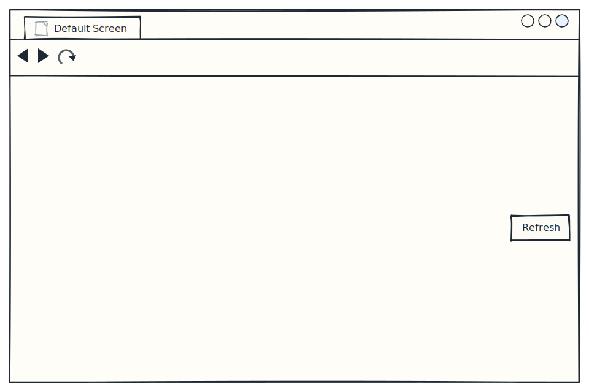

# Default Format


<!-- uisketch:source id="default-screen" format="svg"
```uisketch:svg
browser:
  id: default-screen
  title: Default Screen
  children:
    - button:
        label: Refresh
```
-->
