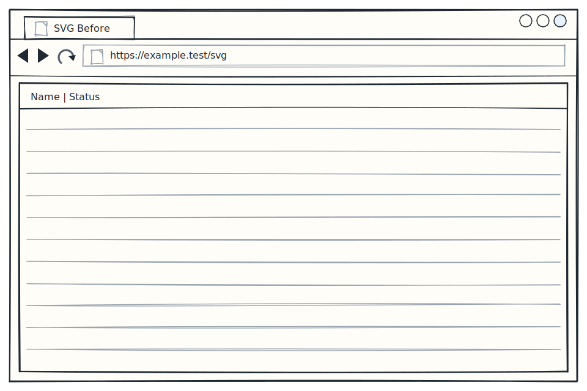

# SVG Before


<!-- uisketch:source id="svg-before" format="svg"
```uisketch:svg
browser:
  id: svg-before
  title: SVG Before
  address: https://example.test/svg
  children:
    - table:
        id: rows
        columns:
          - Name
          - Status
```
-->
